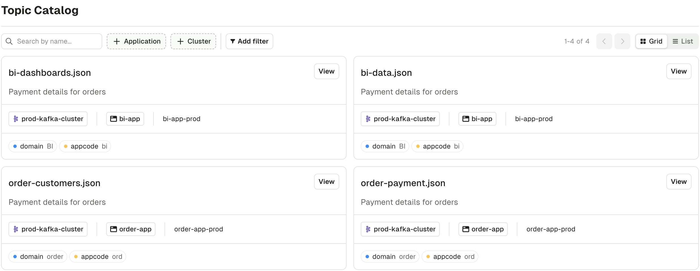

:::tip
Self-service UI is almost entirely Read-only for now.  
Use the CLI to interact with the product.
:::

## Topic Catalog Page

The Topic Catalog lets you search through the Topics marked as public deployed in your organization.

You can filter by multiple dimensions: Application, Kafka Cluster, and also the Topic metadata.

## Topic Subscription

Application owners can subscribe to topics outside their own application directly through the topic catalog. When viewing a topic in the catalog, owners can initiate a subscription request by clicking the "Subscribe" button.

The subscription modal allows you to select from your list of applications and focuses only on valid instances that share the same Kafka cluster as the topic. The interface provides flexible permission configuration, enabling you to request Read or Write permissions for each subscription, and granular control over both user and service account permissions.

Once submitted, subscription requests are routed to the appropriate application owners for review and approval. The status of your requests can be tracked within the application catalog page.