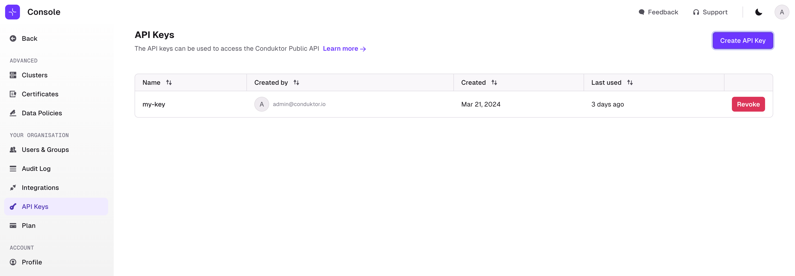
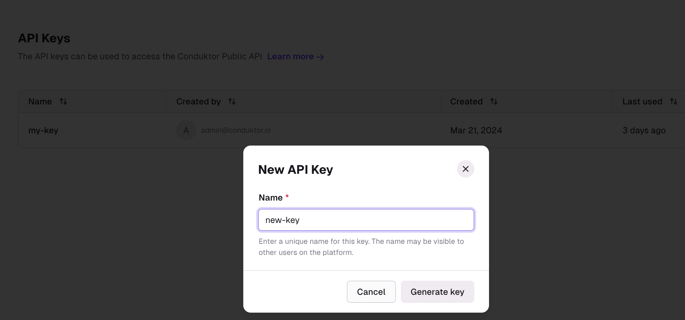
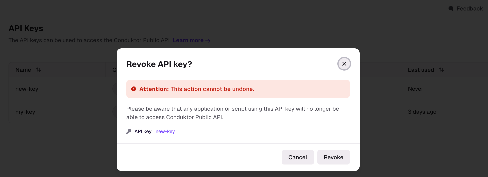

To use the Conduktor API or CLI, you first need to generate an API Key.  
API Keys created from this screen are Admin API Keys.

Check the [CLI Reference](/platform/reference/cli-reference/) and [API Reference](/platform/reference/api-reference/) to see the list of available operations. The scope of API actions is based on your plan, e.g. API keys generated on the free plan cannot create unlimited self-service Applications.

API Keys List displays all the information associated to the keys.

## Operations
### Create API Key
You can create a new API Key by clicking the "Create API Key" button. You will be prompted for a name.

Once created, you will see the associated Key to be used in the API and CLI.

:::caution
The generated API Key won't be visible anymore after closing this screen to make sure to save it properly.
:::

### Revoke API Key
To revoke an API Key, simply click the revoke button and confirm.
