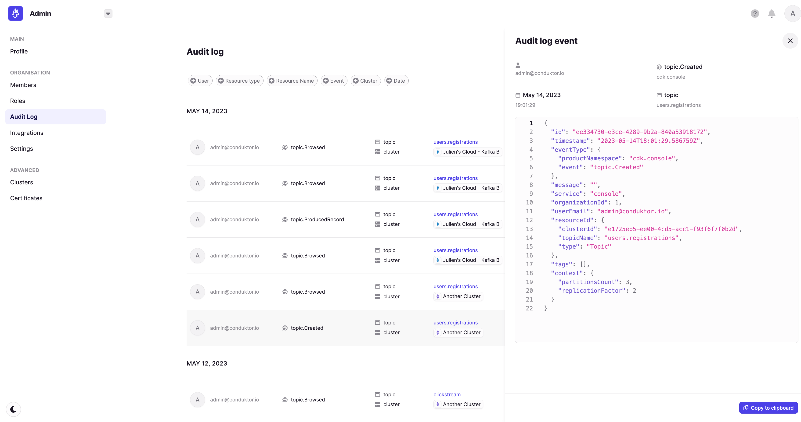
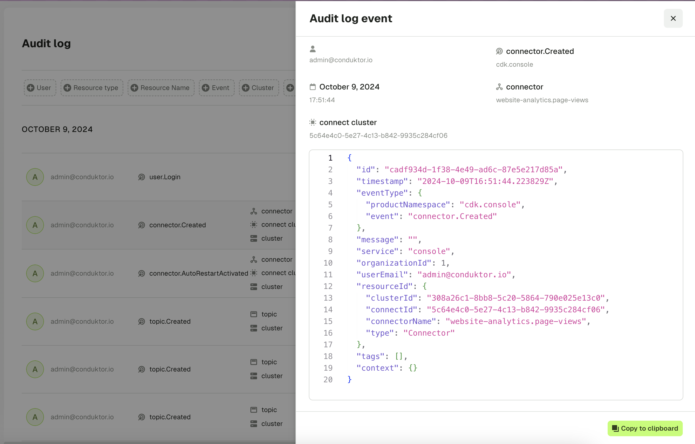
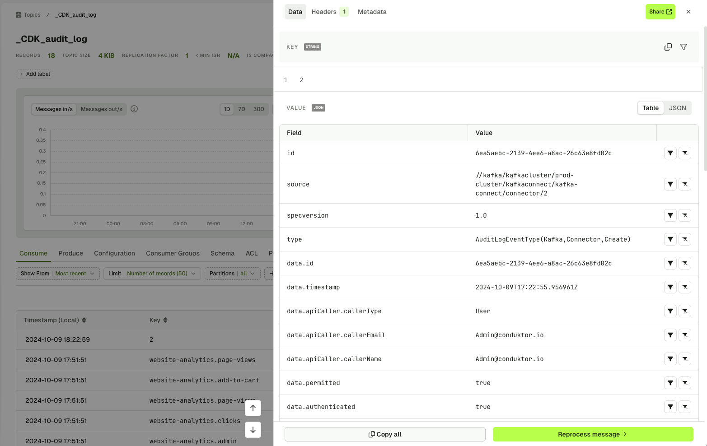

# Audit Log Events

# Overview

As you and your team interact with Conduktor, audit events are captured that give a detailed tracking of actions taken against Kafka. This gives you centralized visibility of user-related and resource-related events. Audit log events.

The audit log events can be browsed, filtered and searched directly within Conduktor's UI or exported from a Kafka topic for any further use you may for them, such as maintaining your own audit trail in other systems.

Clicking on an event in the audit log exposes event-specific metadata. The below example demonstrates an audit event for a new connector added, which can include metadata such as custom tags, the cluster, connector name and its ID.

Audit log events are also exported to a Kafka topic once configured with the right [environemnt variables](docs/platform/get-started/configuration/env-variables.md#auditlog-export-properties), here you can leverage all the benefits of Conduktor when finding a message.

## Audit Events

Below outlines the audit events currently tracked by Conduktor.

  - [Console](#console)
  - [Data Masking](#data-masking)
  - [Topic as a Service](#topic-as-a-service)
  - [Admin](#admin)

## Console

### ResourceType: `Topic`

CRN: `kafka:/cluster/<uuid>/topic/<topic-name>`

- topic.ProducedRecord
- topic.Browsed
- topic.Deleted
- topic.Created
- topic.Updated
- topic.Emptied
- topic.Tagged
- topic.Untagged

### ResourceType: `Subject`

CRN `kafka:/cluster/<uuid>/subject/<subject-name>`

- subject.Created
- subject.Updated
- subject.ChangedCompat
- subject.Deleted
- subject.DeletedVersions
- subject.DeletedVersion

### ResourceType: `SchemaRegistry`

CRN `kafka:/cluster/<uuid>`

- registry.ChangedGlobalCompat

### ResourceType: `ConsumerGroup`

CRN `kafka:/cluster/<uuid>/group/<group-name>`

- consumergroup.Created
- consumergroup.Updated (ResetOffsets)
- consumergroup.Deleted

### ResourceType: `Connector`

CRN `kafka:/cluster/<uuid>/connect/<connect-cluster-id>/<connector-name>`

- connector.Created
- connector.Updated
- connector.Deleted
- connector.Restarted
- connector.RestartedTask
- connector.Paused
- connector.Resumed

## Data Masking

### ResourceType: `DatamaskingPolicy`

CRN `platform:/datamasking/<uuid>`

- policy.Upserted
- policy.Deleted

## Self-Service

### ResourceType: `Application`

CRN `platform:/application/<app-slug>`

- application.Created
- application.Deleted
- application.Updated
- application.access-request.Approved
  from / to
- application.access-request.Rejected

## Admin

### ResourceType: `Cluster`

CRN `kafka:/cluster/<uuid>`

- cluster.Created
- cluster.Updated
- cluster.Deleted

### ResourceType: `Group`

CRN `platform:/group/<uuid>`

- group.Created
- group.member.Added
- group.member.Deleted
- group.permission.Added
- group.permission.Deleted

### ResourceType: `User`

CRN `platform:/user/<email>`

- user.Login
- user.permission.Added
- user.permission.Deleted
- user.platform_role.Updated

## Exported Audit Log Event

the exported audit log event are a new set of events that will replace the current audit log events. The exported audit log events are more detailed and provide more information about the event that happened.
below you will have the list of all the exported audit log events type with a short description.

### Kafka-Related Events

| **Event Type**                | **Description**                                      |
|-------------------------------|------------------------------------------------------|
| **Kafka.Subject.Create**       | Event when a Kafka subject is created.               |
| **Kafka.Subject.Update**       | Event when a Kafka subject is updated.               |
| **Kafka.Subject.Delete**       | Event when a Kafka subject is deleted.               |
| **Kafka.Topic.Create**         | Event when a Kafka topic is created.                 |
| **Kafka.Topic.Update**         | Event when a Kafka topic is updated.                 |
| **Kafka.Topic.Delete**         | Event when a Kafka topic is deleted.                 |
| **Kafka.Topic.Empty**          | Event when a Kafka topic is emptied.                 |
| **Kafka.Connector.Create**     | Event when a Kafka connector is created.             |
| **Kafka.Connector.Update**     | Event when a Kafka connector is updated.             |
| **Kafka.Connector.Delete**     | Event when a Kafka connector is deleted.             |

### IAM-Related Events

| **Event Type**                | **Description**                                      |
|-------------------------------|------------------------------------------------------|
| **Iam.User.Create**            | Event when a new IAM user is created.                |
| **Iam.User.Update**            | Event when an IAM user is updated.                   |
| **Iam.User.Delete**            | Event when an IAM user is deleted.                   |
| **Iam.Group.Create**           | Event when a new IAM group is created.               |
| **Iam.Group.Update**           | Event when an IAM group is updated.                  |
| **Iam.Group.Delete**           | Event when an IAM group is deleted.                  |

### SelfServe-Related Events

| **Event Type**                                        | **Description**                                              |
|-------------------------------------------------------|--------------------------------------------------------------|
| **SelfServe.Application.Create**                      | Event when a self-service application is created.             |
| **SelfServe.Application.Update**                      | Event when a self-service application is updated.             |
| **SelfServe.Application.Upsert**                      | Event when a self-service application is created or updated.  |
| **SelfServe.Application.Delete**                      | Event when a self-service application is deleted.             |
| **SelfServe.ApplicationInstance.Create**              | Event when a self-service application instance is created.    |
| **SelfServe.ApplicationInstance.Update**              | Event when a self-service application instance is updated.    |
| **SelfServe.ApplicationInstance.Delete**              | Event when a self-service application instance is deleted.    |
| **SelfServe.ApplicationGroup.Create**                 | Event when a self-service application group is created.       |
| **SelfServe.ApplicationGroup.Update**                 | Event when a self-service application group is updated.       |
| **SelfServe.ApplicationGroup.Delete**                 | Event when a self-service application group is deleted.       |
| **SelfServe.ApplicationPolicy.Create**                | Event when a self-service application policy is created.      |
| **SelfServe.ApplicationPolicy.Update**                | Event when a self-service application policy is updated.      |
| **SelfServe.ApplicationPolicy.Delete**                | Event when a self-service application policy is deleted.      |
| **SelfServe.ApplicationInstancePermission.Create**     | Event when permissions are created for an app instance.       |
| **SelfServe.ApplicationInstancePermission.Delete**     | Event when permissions are deleted for an app instance.       |

### Admin-Related Events

| **Event Type**                | **Description**                                      |
|-------------------------------|------------------------------------------------------|
| **Admin.KafkaConnect.Create**  | Event when an admin creates a Kafka Connect instance.|
| **Admin.KafkaConnect.Update**  | Event when an admin updates a Kafka Connect instance.|
| **Admin.KafkaConnect.Delete**  | Event when an admin deletes a Kafka Connect instance.|
| **Admin.KsqlDB.Create**        | Event when an admin creates a KsqlDB instance.       |
| **Admin.KsqlDB.Update**        | Event when an admin updates a KsqlDB instance.       |
| **Admin.KsqlDB.Delete**        | Event when an admin deletes a KsqlDB instance.       |
| **Admin.KafkaCluster.Create**  | Event when an admin creates a Kafka cluster.         |
| **Admin.KafkaCluster.Update**  | Event when an admin updates a Kafka cluster.         |
| **Admin.KafkaCluster.Delete**  | Event when an admin deletes a Kafka cluster.         |
