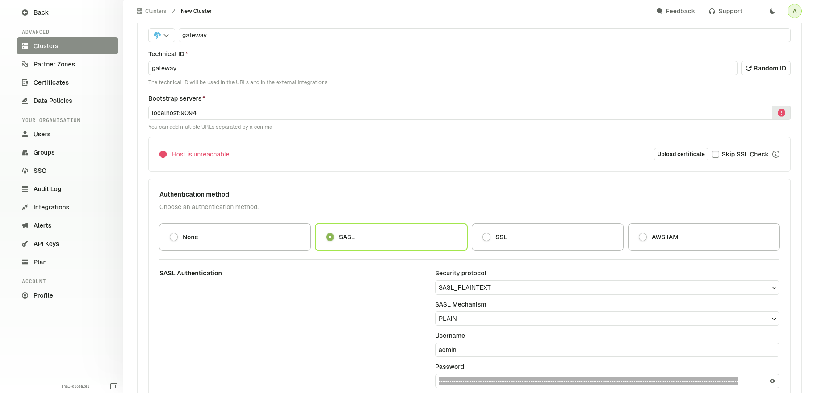
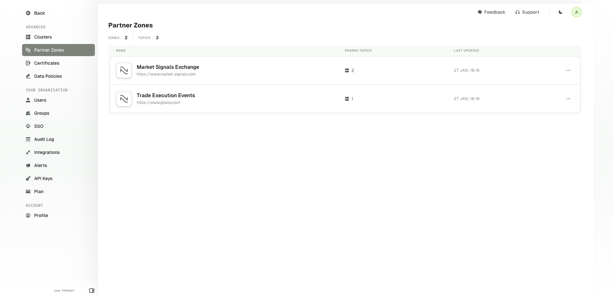
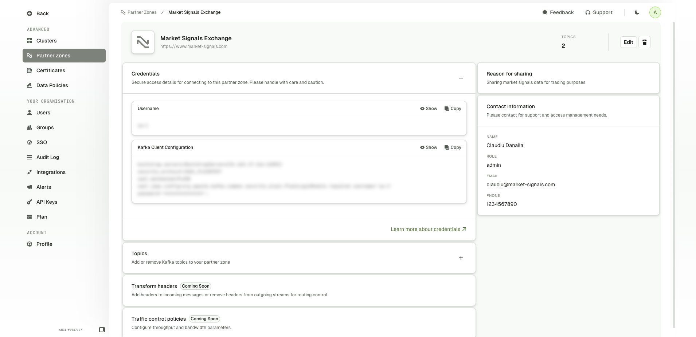
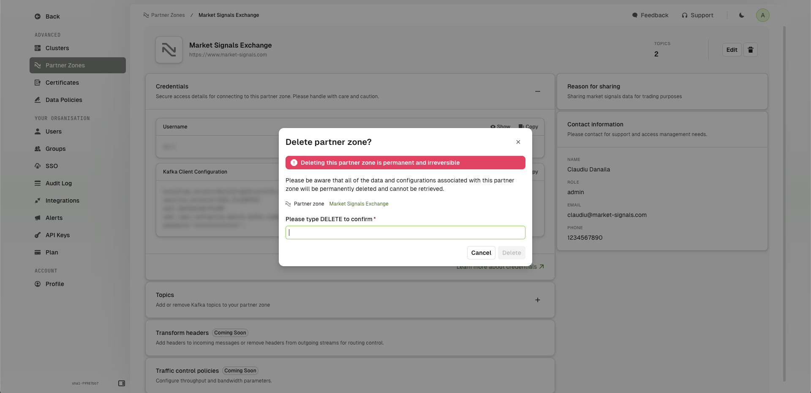

# Partner Zones

## Overview

Partner Zones enable you to securely share your streaming data with external partners, without needing to replicate the data into a second, physical Kafka cluster. 

This permits you to maintain a single source of truth, and eliminate the operational headache of keeping separate data streams in sync.

:::info
Partner Zones is currently in **Beta**, please contact [support](https://support.conduktor.io/) for a demo.

Creating and editing Partner Zones can only be done via the CLI at the moment.
:::

## Configuring a Partner Zone

Note that to configure a Partner Zone you must be on:
 - Console >= 1.31
 - Gateway >= 3.5.0

 **SASL authentication** should also be enabled on gateway.

Firstly, you should connect your gateway to Console. Create a secret token for `admin` user on gateway:

```bash
curl --request POST "http://localhost:8888/admin/vclusters/v1/vcluster/passthrough/username/admin" \
    --user "admin:conduktor" \
    --header 'accept: application/json' \
    --header 'Content-Type: application/json' \
    --data-raw '{"lifeTimeSeconds": 7776000}' | jq -r ".token"
```

Retrieve the returned token and use it to configure SASL authentication in console:



## Create a Partner Zone

Once your gateway is configured on Console, you can create your partner zone through the CLI (support for the UI will be added in the next release). 

```yaml
apiVersion: v2
kind: PartnerZone
metadata:
  name: external-partner-zone
spec:
  cluster: gateway
  displayName: External clients partner zone
  url: https://conduktor.io
  serviceAccount: johndoe
  topics:
    - name: topic-a
      backingTopic: kafka-topic-a
      permission: WRITE
    - name: topic-b
      backingTopic: kafka-topic-a
      permission: READ
  partner:
    name: John Doe
    role: Data analyst
    email: johndoe@company.io
    phone: 07827 837 177
```

Apply the configuration onto Console API:

```bash
conduktor apply -f pz.yaml
```

You can also get the resulting partner zone to check its status:

```bash
❯ conduktor get PartnerZone
---
apiVersion: v2
kind: PartnerZone
metadata:
    name: john-partner-zone
    id: 332b30cd-7bda-4659-b1c1-39986986f0bd
    updatedAt: "2025-01-27T12:55:05.387368Z"
    status: PENDING
spec:
    cluster: gateway
    displayName: John's partner zone
    url: https://conduktor.io
    serviceAccount: johndoe
    topics:
        - name: topic-a
          backingTopic: kafka-topic-a
          permission: WRITE
        - name: topic-b
          backingTopic: kafka-topic-a
          permission: READ
    partner:
        name: John Doe
        role: Data analyst
        email: johndoe@company.io
        phone: 07827 837 177
```

The `metadata.status` field give you the deployment status of your partner zone:
 - `PENDING`: the configuration isn't deployed or refreshed yet
 - `READY`: the configuration is up to date on gateway
 - `FAILED`: Something unexpected happen during the deployment of the configuration


## List Partner Zones

To view a list of Partner Zones, click on the **Partner Zones** tab in the left-hand navigation menu. Note that this page is currently accessible only to admins of Console.



## Partner Zone Details

To view the details of a Partner Zone, click on the Partner Zone name in the list.

The page consists of multiple sections, including:
- Kafka topics that are being shared
- Credentials used to access the data
- Reason for sharing the data
- Contact information of the person responsible for the Partner Zone



## Delete a Partner Zone

To delete a Partner Zone, click on the **Delete** button (with a bin icon) in the top-right corner of the Partner Zone details page. This will bring up a confirmation modal to prevent accidental deletion. Type `DELETE` in the text box and click **Delete** to confirm and delete the Partner Zone.


