# RBAC

## Overview

The Conduktor RBAC system enables you to restrict access to resources and enforce permissions at **User** and **Group** granularity. This is a critical step in ensuring that you have control over your Apache Kafka data.

With Conduktor RBAC, you can:
- Configure access to Conduktor services
- Configure global permissions across **multiple clusters**
- Administer permissions for Kafka resources:
   - Topics
   - Consumer Groups
   - Clusters
   - Subjects
   - Connectors

---
**Jump to:**
- [How to assign permissions?](#how-to-assign-permissions)
- [Manage Services Permissions](#manage-services-permissions)
- [Manage Resources Permissions](#manage-resources-permissions)
  - [Granular Permissions](#granular-permissions)
  - [Prefixes](#prefixes)
  - [Quick Select](#quick-select)
  - [Example](#example)

---

### How to assign permissions?

You can assign two kinds of permissions:
- Services permissions: to see and/or manage Conduktor Console services
- Resources permissions: to interact with Kafka resources

And you can assign those permissions to:
- Users
- Groups

To do so, you can either click on the name of the user/group, or click on the `...` icon on the right of their name, as shown below.

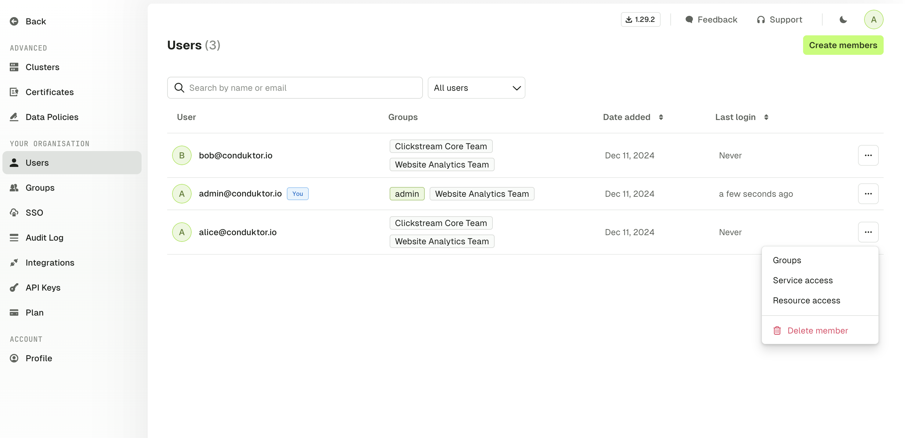

:::info
Please note that permissions are additive, meaning that if a user belongs to multiple groups, they will inherit all the permissions given to these groups.
If they have a restricted access to a topic, but belong to a group that has a full access, then they will have a full access too.
:::

### Manage Services Permissions

You are able to restrict access to Conduktor Console services. The default set of permissions is the one below:

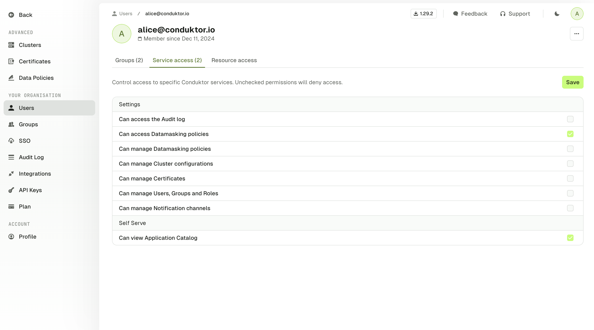

This set of permissions means that the user will not be able to access all the available tabs on the left e.g. to manage certificates or generate API keys.

### Manage Resources Permissions

#### Granular Permissions
The RBAC model is very granular and allows you to go deep into the permissions. Here is a table that recaps the ones you can assign:

| Resource         | Permissions           |
| ---------------- | --------------------- |
| Topics           | View config           |
| Topics           | Consume               |
| Topics           | Produce               |
| Topics           | Create                |
| Topics           | Delete                |
| Topics           | Empty                 |
| Topics           | Add partitions        |
| Consumer groups  | Viewer                |
| Consumer groups  | Reset                 |
| Consumer groups  | Create                |
| Consumer groups  | Delete                |
| Subjects         | View                  |
| Subjects         | Edit compatibility    |
| Subjects         | Create / Update       |
| Subjects         | Delete                |
| Kafka connectors | View task & status    |
| Kafka connectors | View config           |
| Kafka connectors | Edit config           |
| Kafka connectors | Deploy                |
| Kafka connectors | Delete                |
| Kafka connectors | Restart               |
| Kafka connectors | Pause / Resume        |
| Clusters         | View ACL              |
| Clusters         | Manage ACL            |
| Clusters         | View broker           |
| Clusters         | Edit broker           |
| Clusters         | Edit SR compatibility |

All these permissions can be applied on one specific cluster, or all your clusters.

#### Prefixes

When you define a permission, you might want it to be applied to:
- A specific topic, by typing `my-topic` for instance
- All the topics, by using a wildcard `*`
- A subset that starts with a certain prefix, by typing `my-prefix-*`

Here is an example of those three cases within the UI:

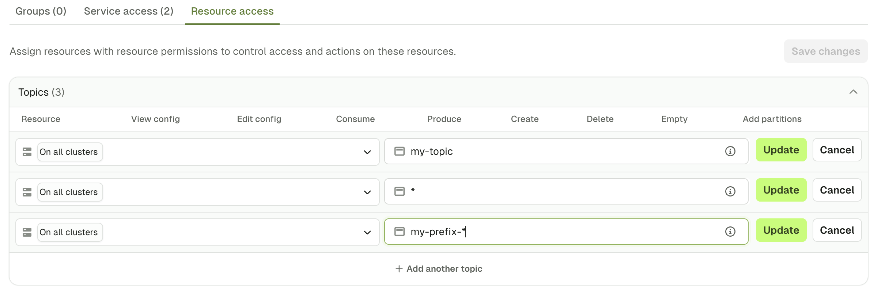

The exact same works for other Kafka resources.

#### Quick Select

In order to save time during the permissions creation, you can use the `Quick select` to give a default set of permissions or set this up using the CLI, API or Terraform.

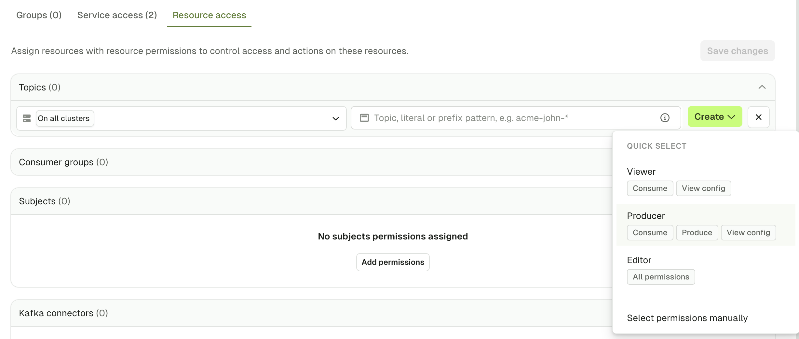

The screenshots below show the different `Quick select` sets of permissions (for topic patterns 1, 2, 3 respectively).

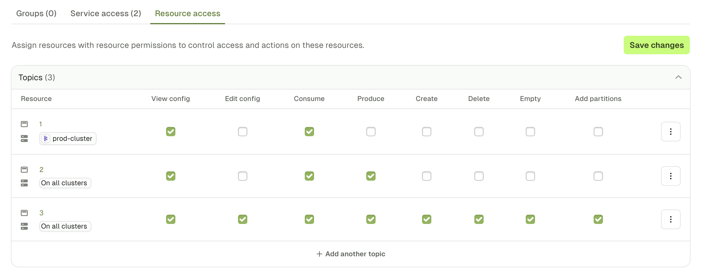
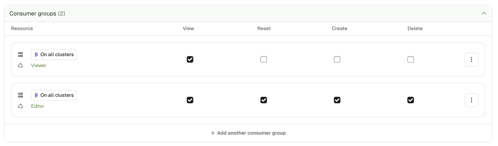
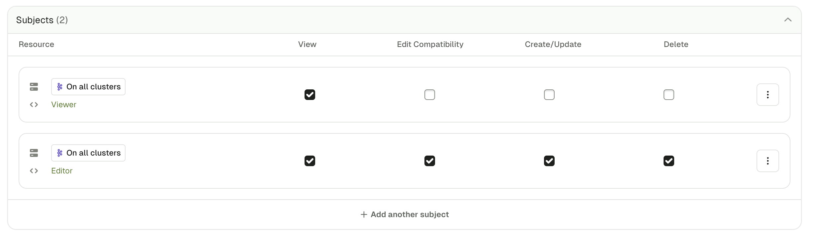
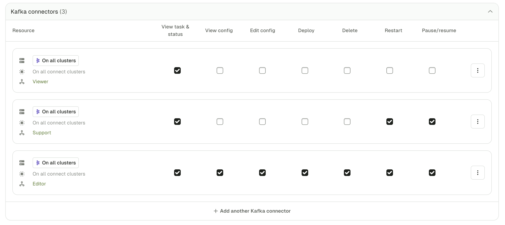
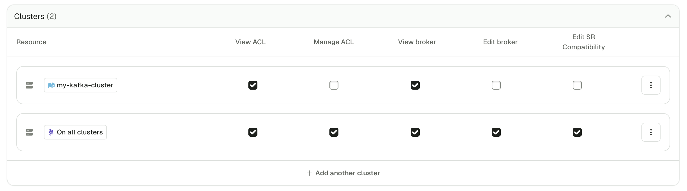
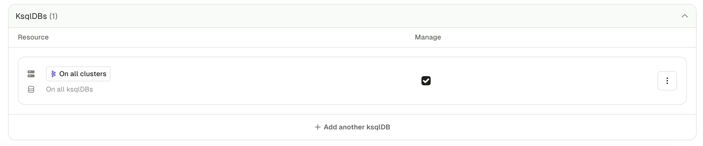

For the `Clusters` permissions, the first set is for `Viewer`, and the second one is for `Admin`.

For the `ksqlDBs`, we have the `Editor` permission.

If the `Quick select` doesn't fit your need, you can still `Select permissions manually` by checking the exact boxes you need.

#### Example

Here is an example of a set of permissions given to Alice:

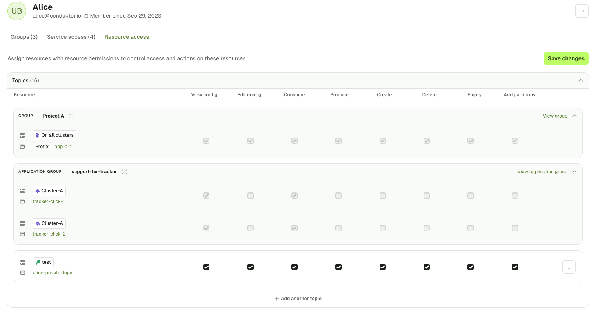

We can see that this is a recap of all the permissions this user has.

In grey, we have the permissions Alice inherits from the group `Project A`, and in white the ones that are assigned to her directly.

This set of permissions gives her:
- Full access to both the topic `alice-private-topic` and to the consumer group `alice-consumers`, on the cluster `test`
- Partial access on all topics and consumer groups, that start with the prefix `app-a-`, across all clusters and that she inherits this from the group `Project A`
