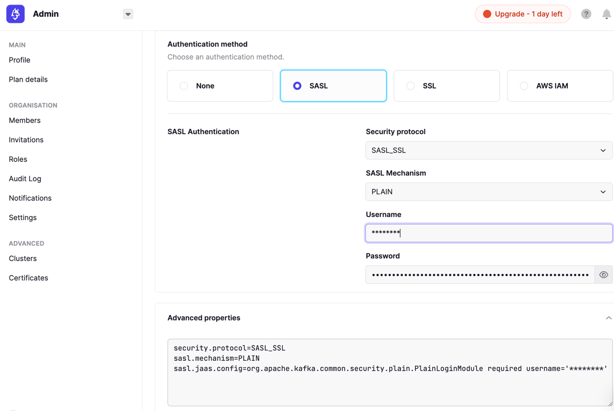

This page covers the basic security available the open source version of Conduktor Gateway.

Jump to [Enterprise Security](./enterprise_proxy_security.md) for the Enterprise security.

# Concepts
There are two sets of configuration to consider when securing your gateway.

 - The connection between the gateway and the Kafka cluster
 - The connection between Kafka clients and the gateway


## Kafka client to Conduktor Gateway security configuration

The connections to gateway from Kafka clients can be secured by a simple user id and password configuration.  The traffic can also be encrypted using TLS.


```yaml
authenticationConfig:
  authenticatorType: - the authentication type for client <--> gateway e.g. NONE
  sslConfig:
    updateContextIntervalMinutes: - the interval to check for for SSL context changes e.g. 5
    keyStore:
      keyStorePath: - path to a SSL keystore  e.g. config/kafka-gateway.keystore.jks
      keyStorePassword: - the keystore password
      keyPassword: - the key password
      keyStoreType: - the keystore type e.g. jks
      updateIntervalMsecs: - the interval to check for keystore changes e.g. 600000
```

## Conduktor Gateway to Kafka cluster configuration

The configuration for connecting to the Kafka cluster is a standard kafka configuration file.

This means that the Conduktor Gateway can connect to any Kafka cluster that a standard Kafka application can connect to.

Gateway configuration is set in a kafka.config properties file, the location of which is configured by your gateway configuration file.

A default gateway configuration file can be found at `<GATEWAY_DOWNLOAD_LOCATION>/gateway-core/config/application.yaml`

The location of the Kakfa properties file used to connect to the backing Kafka cluster is set by the kafkaSelector section in the yaml file:

```yaml
kafkaSelector:
  type: file
  path: gateway-core/config/kafka.config
```

To update the connection details, edit the kafka.config file with the connection information of the Kafka cluster you wish to connect to.

For example, to connect to the the Conduktor Playground use the credentials that can be found at `https://<ORGANISATION>.conduktor.app/admin/cluster/<CLUSTER-NAME>`

To find these, navigate to [Conduktor.io](https://conduktor.io) -> Admin -> Clusters -> Select Cluster -> Advanced Properties where you can find configuration similar to:

```properties
bootstrap.servers=cluster.playground.cdkt.io:9092
security.protocol=SASL_SSL
sasl.mechanism=PLAIN
sasl.jaas.config=org.apache.kafka.common.security.plain.PlainLoginModule required username='<USERNAME>' password='<JWT.TOKEN.STRING>';
```



Or, to connect to a Confluent Cloud instance use configuration similar to:

```properties
bootstrap.servers=pkc-abc123.europe-west1.gcp.confluent.cloud:9092
security.protocol=SASL_SSL
sasl.jaas.config=org.apache.kafka.common.security.plain.PlainLoginModule required username='{{ CLUSTER_API_KEY }}' password='{{ CLUSTER_API_SECRET }}';
sasl.mechanism=PLAIN
```
