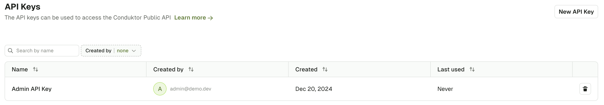

import Tabs from '@theme/Tabs';
import TabItem from '@theme/TabItem';

# Terraform Reference

The [Conduktor Terraform Provider](https://registry.terraform.io/providers/conduktor/conduktor/latest/docs) gives you the ability to perform some operations on Conduktor Console state directly from existing [Terraform](https://developer.hashicorp.com/terraform/intro) Infrastructure-as-Code environment.

:::warning Warning ⚠
- Conduktor Terraform Provider is currently in **Alpha** and doesn't support all Conduktor resources at this time.
- Let us know if you have [feedback](https://conduktor.io/roadmap) or wish to be a design partner.
:::

## Install & Configure

The provider should be installed automatically with `terraform init`, but it's recommended to pin a specific version or range of versions using the following [`required_providers`](https://developer.hashicorp.com/terraform/language/providers/requirements) configuration:

```hcl
terraform {
  required_providers {
    conduktor = {
        source = "conduktor/conduktor"
        version = "~> X.Y" # where X.Y is the current major version and minor version
    }
  }
}
```

### Configure

To use the Conduktor Terraform Provider, you need to define some minimal configuration:
- The URL of Conduktor Console
- The authentication mechanism
  - Using an API key
  - Using local user (usually admin account) credentials

You can find the full configuration reference [here](https://registry.terraform.io/providers/conduktor/conduktor/latest/docs).

### Using API key authentication

````hcl
# configure provider
provider "conduktor" {
    console_url = "http://localhost:8080"
    api_token = "your-api-key"
}
````

There are 2 types of API Keys:

<Tabs>
<TabItem  value="admin-api-key" label="Admin API Key">

Admin API Keys grant the maximum permissions on Console.
They are generated either from the UI or using the  [CLI](/platform/reference/cli-reference/).

  <Tabs>
  <TabItem  value="CLI" label="CLI">

````bash
# Generate a key named my-admin-key
$ conduktor token create admin my-admin-key
AWpw1sZZC20=.29Qb9KbyeQTrewMtnVDYAprxmYo7MUQats2KHzVhx+B/kGOBuIoH8CMsjOcvolUjLKFqbQNSvY0/98wb8mqxU4NwQTSgbSSAlLxau3caByHR6/X9EeqQdj3Lhf0xCzh87/GxYK5JG2DI1VWj55A6xcH++ottyG909PwuGe/GIwgfxX3FKaopg8hxgUmPJNRSWqX+75a8eQi014J4YxuTD7w+723kOQBTXOysfGUaYnfwCCjPPmSWXEEqy5wkH2NS+jXi3S6+fH0ts8CoqvV6Z8YLmBupdMgCtJ9MVBYeDarIzQw6XY7yNuypUqer0dcd9B3KyVR8ecNpFiF7ybvP4g==
````

  </TabItem>
  <TabItem value="GUI" label="UI">
Navigate to Settings > API Keys

Select **New API Key** to generate a new API key.


  </TabItem>
  </Tabs>

</TabItem>
<TabItem value="self-service-application-api-key" label="Self-service Application API Key">

Self-service Application API Key permissions are limited to the scope of the ApplicationInstance for which they have been generated.
Check the [Self-service documentation](/platform/navigation/self-serve/) for more details.
They can be obtained either from the UI or using the [CLI](/platform/reference/cli-reference/).

  <Tabs>
  <TabItem  value="CLI" label="CLI">

````bash
$ conduktor token create application-instance -i=<my-app-instance> my-app-instance-key
AWpw1sZZC20=.29Qb9KbyeQTrewMtnVDYAprxmYo7MUQats2KHzVhx+B/kGOBuIoH8CMsjOcvolUjLKFqbQNSvY0/98wb8mqxU4NwQTSgbSSAlLxau3caByHR6/X9EeqQdj3Lhf0xCzh87/GxYK5JG2DI1VWj55A6xcH++ottyG909PwuGe/GIwgfxX3FKaopg8hxgUmPJNRSWqX+75a8eQi014J4YxuTD7w+723kOQBTXOysfGUaYnfwCCjPPmSWXEEqy5wkH2NS+jXi3S6+fH0ts8CoqvV6Z8YLmBupdMgCtJ9MVBYeDarIzQw6XY7yNuypUqer0dcd9B3KyVR8ecNpFiF7ybvP4g==
````

  </TabItem>
  <TabItem value="GUI" label="UI">

Navigate to Applications, pick your Application, then under Application Instances tabs, you will find a button to generate an API Key:


  </TabItem>
  </Tabs>
</TabItem>
</Tabs>
<hr />

### Using short lived user credentials authentication

This type of API Key will have the permissions of the user who created it.
It is forged at provider configuration using login API, and it only works for Local Users or LDAP users.
Short-lived User API Keys will be valid for the same duration as the configured [Session Lifetime](/platform/get-started/configuration/user-authentication/session-lifetime/).
**OIDC users can't be used here.**

````hcl
# configure provider
provider "conduktor" {
    console_url = "http://localhost:8080"
    admin_email    = "console-admin@mycompany.io"
    admin_password = "console-admin-password"
}
````

### Environment variables

Provider configuration also supports environment variables for all attributes.

| Environment Variables                | HCL Value        | Description |
|--------------------------------------|------------------|-------------|
| `CDK_CONSOLE_URL`  or `CDK_BASE_URL` | `console_url`    | Console base url e.g. `http://localhost:8080` |
| `CDK_API_TOKEN` or `CDK_API_KEY`     | `api_token`      | Console [API Key](#using-api-key-authentication) |
| `CDK_ADMIN_EMAIL`                    | `admin_email`    | Console [user login](#using-short-lived-user-credentials-authentication) email |
| `CDK_ADMIN_PASSWORD`                 | `admin_password` | Console [user login](#using-short-lived-user-credentials-authentication) password |
| `CDK_CERT`                           | `cert`           | Cert in PEM format to authenticate using client certificates |
| `CDK_INSECURE`                       | `insecure`       | Skip TLS verification flag. Defaults to `false` |
| `CDK_CA_CERT`                        | `cacert`         | Root CA certificate in PEM format to verify the Conduktor Console certificate |
| `CDK_KEY`                            | `key`            | Key in PEM format to authenticate using client certificates |

:::info
The configuration resolution is (by order of priority) :
1. HCL values
2. Environment variables
3. Default values (if applicable)
:::

## Provider Usage

Once the provider is configured all [currently available](#available-resources) resources can be used in the Terraform definition.

### Usage Example
Full example of user and group creation using Conduktor Console locally available on port `8080` with default admin account credentials `admin@mycompany.io` / `admin_password`.

```hcl title="conduktor-iac.tf"
# Provider installation configuration
terraform {
  required_providers {
    conduktor = {
        source = "conduktor/conduktor"
        version = ">= 0.1.0"
    }
  }
}

# Provider configuration
provider "conduktor" {
    console_url = "http://localhost:8080"
    admin_email    = "admin@mycompany.io"
    admin_password = "admin_password"
}

# Create example_user, Bob
resource "conduktor_user_v2" "bob" {
  name = "bob@mycompany.io"
  spec {
    firstname   = "Bob"
    lastname    = "Smith"
    permissions = [
        {
            resource_type = "PLATFORM"
            permissions   = ["userView", "datamaskingView", "auditLogView"]
        }
    ]
  }
}

# Create a group with Bob as a member
resource "conduktor_group_v2" "example_group" {
  name = "team-a"
  spec {
    display_name = "team-a"
    description  = "The group of team-a"
    members      = [ conduktor_user_v2.bob.name ]
    permissions  = []
  }
}
```

Then on a terminal with Terraform [installed](https://developer.hashicorp.com/terraform/install) and in a directory containing `conduktor-iac.tf` file.
```shell
# Initialize terraform project
terraform init

# Plan to preview the changes Terraform will make to match your configuration.
terraform plan

# Apply to make the planned changes.
terraform apply
```

Now if you navigate to the Conduktor UI, you will see a new user, Bob, and team-a's group created.

Login using an external SSO (LDAP or OIDC) with email `bob@mycompany.io` and you will be recognized by Conduktor, and end up in the `team-a` Group.

To revert the Conduktor state you can destroy created resources using `terraform destroy`


For more details on Terraform CLI commands and usage check the Hashicorp [documentation](https://developer.hashicorp.com/terraform/cli/commands).

### Available resources

For the full list of resources see the [provider page](https://registry.terraform.io/providers/conduktor/conduktor/latest/docs).


#### Case of the `generic` resource

The `generic` resource leverage the YAML format used by the CLI to be used as resource definition in Terraform.

This is an experimental resource that has several [limitations](https://registry.terraform.io/providers/conduktor/conduktor/latest/docs/resources/generic#limitations) and is subject to breaking changes in future releases. Do not include in your production workflows as this is unsupported.


## More documentation reference
- Terraform [introduction](https://developer.hashicorp.com/terraform/intro)
- Terraform HCL [documentation](https://developer.hashicorp.com/terraform/language)
- Terraform CLI [documentation](https://developer.hashicorp.com/terraform/cli/commands)
- Conduktor Terraform provider [registry](https://registry.terraform.io/providers/conduktor/conduktor/latest)
