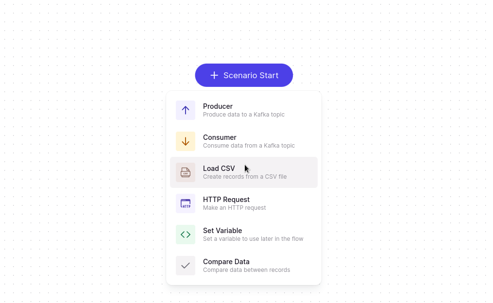
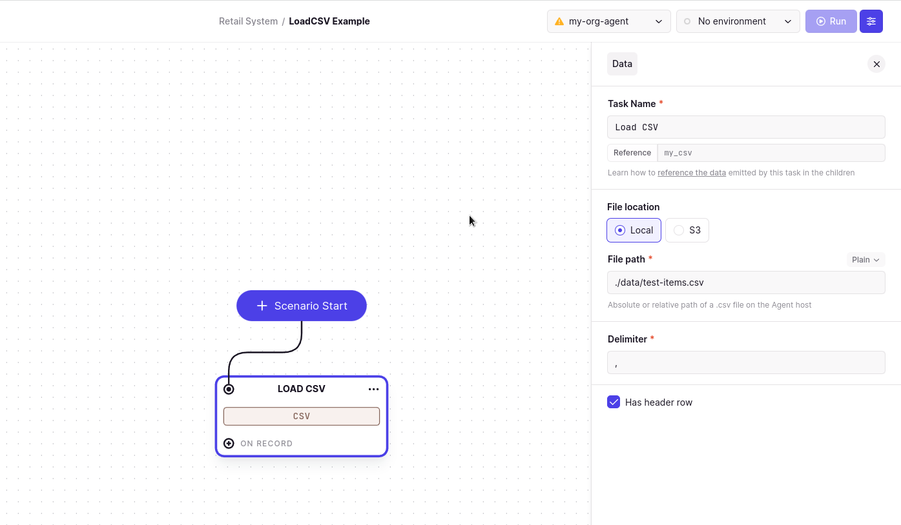
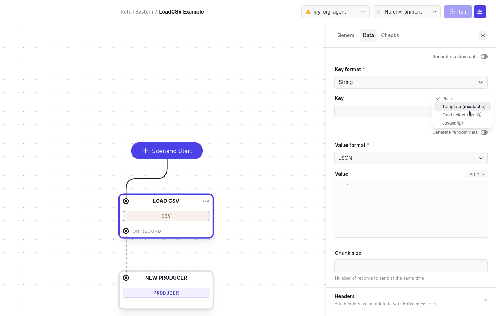
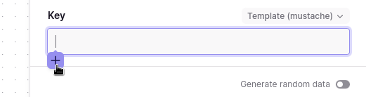
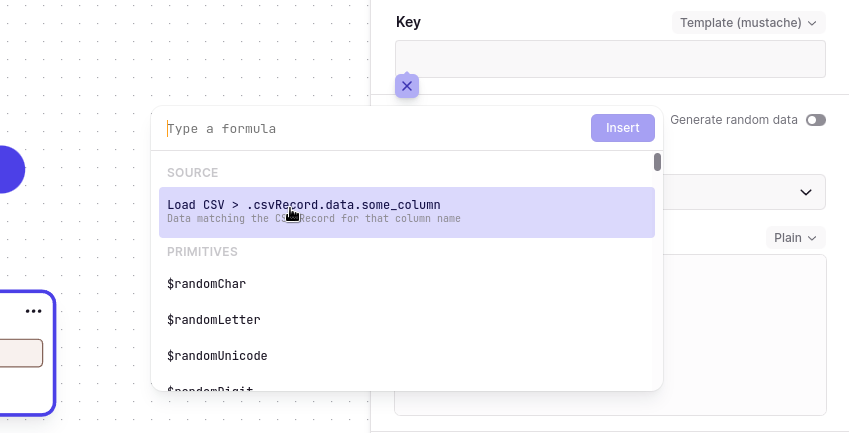
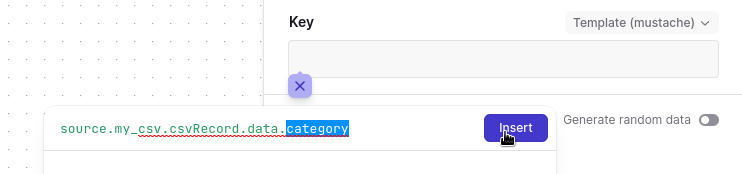
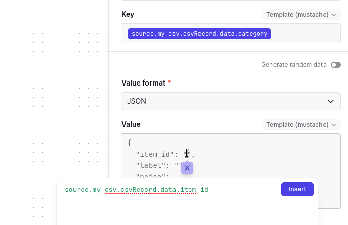
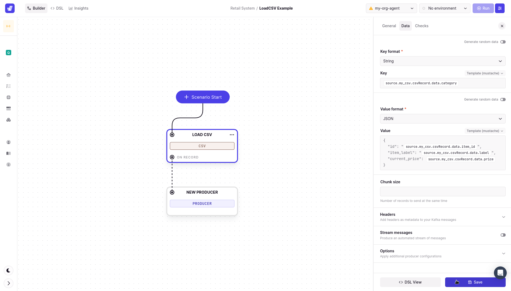
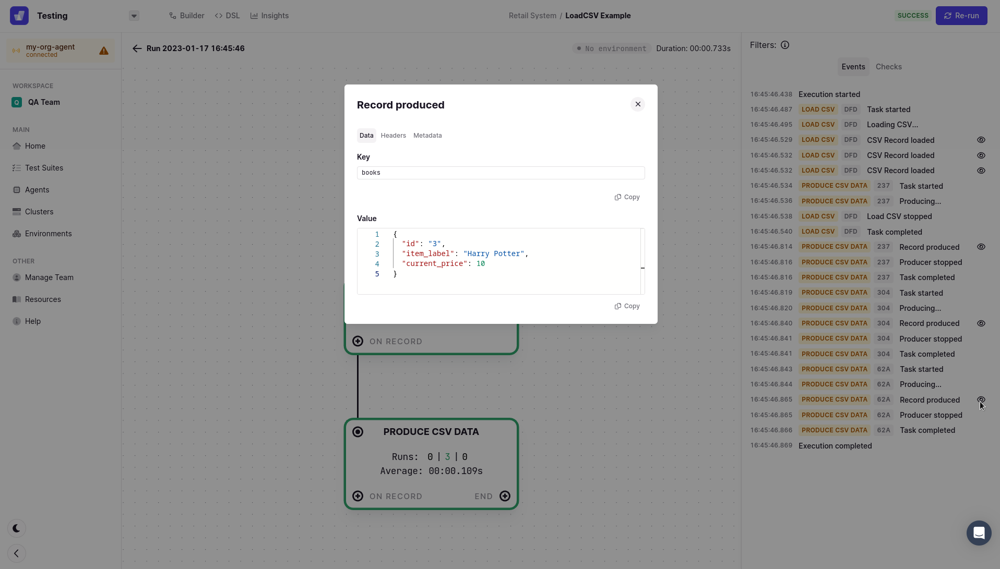

# Load CSV Task

Use the **LoadCSV** task to load data from a CSV file into your test suite.

The CSV can be loaded from a local file, or from a remote S3 server.

This lets you configure and change your test data outside of the scenario.
It also allows "dynamic" CI integrations, where the data is built by another test or service before executing the task.

## Creating a Load CSV Task

When inside the editor for a new scenario, select the **Scenario Start** button and select **Load CSV.**&#x20;



## File Location

### Local File

There are a few things to understand regarding this option :

- The file must be on the same filesystem as the agent (may be different from your local machine)
- CSVs are loaded on execution, not before. We don't store the data ahead of the test, so the file must be present on execution

This is particularly useful for local development, or for cases where the data is generated in the CI pipeline before the execution.
For all other cases, the S3 option may be more suitable.

You can use local or absolute paths. You can also use

### S3

This option lets you load a CSV from a S3-compatible source.
This lets you manage your test data buckets independantly from the test suite.

#### S3 Credentials

The agent uses the default AWS credentials chain to authenticate to S3, as defined in [AWS documentation](https://docs.aws.amazon.com/sdk-for-java/v1/developer-guide/credentials.html#credentials-default).

This means that the credentials should be configured on the agent host, and are never passed to the server.

You can also define them when launching the agent :

- In the CI action or jar, via the `AWS_ACCESS_KEY_ID` and `AWS_SECRET_ACCESS_KEY` environment variables,
- Or to the jar via command line arguments : `java -Daws.accessKeyId=... -Daws.secretKey=... -jar ...`

## Producing the CSV data into Kafka

A common use case is to use the Load CSV task as the entry point for a test suite, and then use the loaded data to produce messages into Kafka.

### Example: CSV Data and Kafka Producer

In this example, we will demonstrate how to load csv data from a local file, and then use the data to produce messages into Kafka.

#### CSV Task

- Create a Load CSV task
- Update the reference to `my_csv` to simplify the chaining
- Set the file location to `Local File`
- Provide the path to a csv file on the agent filesystem, e.g. `/tmp/data.csv` (or `C:\tmp\data.csv` on Windows)

  - For this example our csv file contains the following data:

  ```
  category,item_id,label,price
  electronics,1,TV,1000
  electronics,2,Phone,500
  books,3,Harry Potter,10
  ```

  - We will want to use the `category` column as the key for our messages, and a JSON object containing the other columns as the value

- In this example, the delimiter is `,` (comma)
- We have a header row, so we check the `Has header` checkbox. Headers will be derived from the first row of the CSV file.



- Save the task

#### Producer Task

- Chained to the `On Record` port of the Load CSV task, add a **Producer** task to the canvas
- Configure the Cluster and Topic
- Go to the **Data** tab
- For the key :

  - Choose the `String` data format
  - Change the type of input to Template (mustache)

    

  - Click in the input, then on the `+` button

    

  - The first proposition will be an example of data selection. Let's use that, and replace `column_name` with `category`

    

    

- For the value, we will build a JSON object from the other columns

  - Choose the `JSON` data format
  - Change the type of input to Template (mustache)
  - To send the whole CSV record as `{[column_name]: column_value}`, we could use the same method as for the key, but without a column name.
    - {{source.my_csv.csvRecord.data}}
  - Instead for this example, we will build a custom JSON by using that method on individual fields, to allow customization.

    

    Notice the quotes around string fields. The template engine will not add them automatically, make sure to add them where needed.

  Here is the resulting template :

  ```json
  {
    "item_id": "{{source.my_csv.csvRecord.data.item_id}}",
    "item_label": "{{source.my_csv.csvRecord.data.label}}",
    "price": {{source.my_csv.csvRecord.data.price}}
  }
  ```

  

- Save the task. We're ready to run our scenario !

#### Run Scenario

Run your scenario, and observe the execution events.

We can preview the loaded events and the produced record.
Click on the eye icon on a **Record produced** event to see the resulting events.



We've produced custom data based on our CSV !

You can now complete your test suite with other tasks, such as a consumer task to validate the data at any point of your system.
