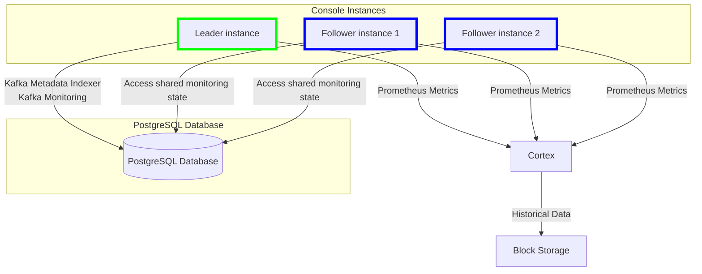

import Tabs from '@theme/Tabs'; import TabItem from '@theme/TabItem';

## Min hardware spec

|  |Gateway | Console |
| :------ | :--- |:--- |
| RAM | 4 GB  | 3 GB |
| CPU cores | 2 | 2|
| Disk space | N/A | 5 GB |

## Gateway requirements

Conduktor <GlossaryTerm>Gateway</GlossaryTerm> is provided as a [Docker image](/guide/conduktor-in-production/deploy-artifacts/deploy-gateway) and a [Helm chart](/guide/conduktor-in-production/deploy-artifacts/deploy-gateway/kubernetes).

#### Minimum setup

Per Gateway node, for light usage:

- 2 CPU cores
- 4 GB of RAM

Running on this level of machine, each Gateway instance should support around *20-30 MB/s* of sustained throughput with a minimal effect on latency.

#### Recommended starting setup

Per Gateway node, for medium to high usage:

- 4 CPU cores
- 8 GB of RAM

Running on this level of machine, each Gateway instance should support around *40-50 MB/s* of sustained throughput with a minimal effect on latency.

For **production setups** we recommended that you **run at least three Gateway instances**. Any further scaling should be done horizontally first: to increase throughput, add instances to the cluster.

#### Local storage requirements

Gateway itself doesn't use local storage but certain interceptors, such as [large message handling](/guide/use-cases/manage-large-messages), might require temporary local storage.

#### Scaling Gateway

Conduktor Gateway is **designed to scale horizontally or vertically**, as required.

Depending on your needs and use cases, one or both of these methods may be used to get the best out of Conduktor. Multiple instances of Gateway can be run as a cluster and Gateway will handle the load balancing and other work distribution concerns between the nodes in a cluster.

Gateway is predominantly CPU bound - it stores very little, unless you've configured or adjusted the default caching setup. The recommendation here represents a good starting point - to further scale you should use the metrics produced by gateway to tune the installation to your workloads.

#### Interceptor impact

Gateway should be tuned to your workloads based on the <GlossaryTerm>Interceptors</GlossaryTerm> you intend to run - they generate most of the CPU load for Gateway.

The Interceptors sit in line with the processing of a request, so they affect the end-to-end latency. Some do a lot more work than others. For example, any interceptor that needs to inspect the data being sent (such as field-level encryption or data quality), has a high CPU requirement. This is because the intercepted data has to be de-serialized and re-serialized.

For high CPU loads, you should also add more memory in addition to cores. We recommend to configure 4 GB of RAM per CPU. This provides more headroom for the underlying memory management to run (predominantly for the garbage collection in the JVM).

#### Kafka requirements

Conduktor Gateway requires Apache Kafka version to be 2.5.0 or higher (but lower than v4.0.0).

Gateway should connect to Kafka as an **admin user**. At a minimum, this user should have access to:

- manage topics and consumer groups
- commit offsets
- describe cluster information

## Console requirements

Conduktor <GlossaryTerm>Console</GlossaryTerm> is provided as a single Docker container.

### Production requirements

For **production environments**, there are **mandatory requirements** to ensure that your deployment is reliable, durable and can be recovered easily. To meet these requirements, you have to:

- Set up an [external PostgreSQL (13+) database](/guide/conduktor-in-production/deploy-artifacts/deploy-console/#configure-postgres-database) with appropriate backup policy
  - this is used to store data relating to your Conduktor deployment (such as users, permissions, tags and configurations)
  - we recommend configuring your PostgreSQL database for [high-availability](#database-connection-fail-over)
- Set up [block storage](/guide/conduktor-in-production/deploy-artifacts/deploy-console/#monitoring-properties) (S3, GCS, Azure, Swift) to store monitoring data
- Follow the hardware requirements below so that Conduktor has sufficient resources to run without issues
- Use Apache Kafka version 2.5.0 or higher (but lower than v4.0.0).

If you're deploying the [Helm chart](/guide/conduktor-in-production/deploy-artifacts/deploy-console/kubernetes), the **production requirements** are outlined the installation guide.

### Hardware requirements

To configure Conduktor Console for particular hardware, you can use container CGroups limits. [Find out more about memory configuration](#memory-configuration).

#### Minimum

- 2 CPU cores
- 3 GB of RAM
- 5 GB of disk space

#### Recommended

- 4+ CPU cores
- 4+ GB of RAM
- 10+ GB of disk space

[Check out the environment variables](/guide/conduktor-in-production/deploy-artifacts/deploy-console/env-variables) or [get started with Docker](/guide/get-started).

### Memory configuration

:::info
**RUN_MODE** has been deprecated. We now rely on container CGroups limits and use up to 80% of the container memory limit for JVM max heap size.
:::

```bash
-XX:+UseContainerSupport -XX:MaxRAMPercentage=80
```

You now only need to care about the limits that you set on your container.  

<Tabs>
<TabItem value="Console Helm" label="Console Helm">

```yaml
# Values.yaml
...
platform:
  resources:
    limits:
      memory: 8Gi
...
```

</TabItem>
<TabItem value="Kubernetes" label="Kubernetes">

```yaml
# deployment.yaml
apiVersion: apps/v1
kind: Deployment
...
template:
  spec:
    containers:
      - name: console
        image: conduktor/conduktor-console
        resources:
          limits:
            memory: 8G
...
```

</TabItem>
<TabItem value="Docker Compose" label="Docker Compose">

```yaml
# docker-compose.yaml
...
  conduktor-console:
    image: conduktor/conduktor-console
    deploy:
      resources:
        limits:
          memory: 8G
...
```

</TabItem>
</Tabs>

[Find out more about JVM in Linux containers](https://bell-sw.com/announcements/2020/10/28/JVM-in-Linux-containers-surviving-the-isolation/).

### Deployment architecture

Here's an external persistent store (PostgreSQL) and a leader election service, used to manage stateful data and monitoring tasks across multiple Console instances:



#### State persistence in PostgreSQL

##### Multiple instances

From Console v1.25.0, the monitoring state is stored in the external PostgreSQL database, allowing it to be shared and accessed by all instances of Console. This brings several advantages:

- **Consistency**: multiple Console instances can be deployed with a leader elected to handle the stateful components (Kafka [Indexing](/guide/conduktor-concepts/indexing) and monitoring).
- **Redundancy and fault tolerance**: if the leader instance fails, another one takes over as the leader without losing any monitoring data.
- **Prometheus metrics**: every Console instance is now capable of exposing [Prometheus metrics](/guide/monitor-brokers-apps/monitor-metrics) through the API. This allows for real-time monitoring of the application regardless of which instance is the leader - the monitoring state is available to all instances.

#### High-availability limitations

 While this architecture greatly improves the UI layers' horizontal scalability, there are notable limitations related to the use of <GlossaryTerm>Cortex</GlossaryTerm> for metrics storage.

#### Cortex in standalone mode

The system currently uses Cortex in standalone mode, which doesn't inherently provide high availability. The implications of this limitation are:

- **Metric  and alerting unavailability**: in the event of Cortex failure, monitoring data and alerting functionality inside Console might not be accessible until the container is restarted.
- **No redundancy**: without a multi-node or clustered setup for Cortex, the system lacks the resilience and failover capabilities that are present in other components like Console and PostgreSQL.

##### Database connection fail-over

Since v1.30 Console supports using multiple database URLs in configuration to achieve high availability (HA). For example, [connection fail-over](https://jdbc.postgresql.org/documentation/use/#connection-fail-over).

For Conduktor configuration details see [multi-host database configuration](/guide/conduktor-in-production/deploy-artifacts/deploy-console/#multi-host-configuration) which supports multiple hosts.

Discuss the Postgresql HA configuration with your architect. One example is to use [Bitnami's postgresql-ha chart](https://github.com/bitnami/charts/blob/main/bitnami/postgresql-ha/README.md#differences-between-the-postgresql-ha-and-postgresql-helm-charts).

### Kafka ACL requirements

Conduktor Console requires the following ACLs to take advantage of all the capabilities of the product:

| Permission | Operation | ResourceType   | ResourceName  | PatternType | Description                        |
|------------|-----------|----------------|---------------|-------------|------------------------------------|
| ALLOW      | ALL       | TOPIC          | *             | LITERAL     | Full management of topics          |
| ALLOW      | ALL       | CONSUMER GROUP | *             | LITERAL     | Full management of consumer groups |
| ALLOW      | ALL       | CLUSTER        | kafka-cluster | LITERAL     | Full management of the cluster     |

If you prefer to provide read-only access to Conduktor Console, these are the minimum ACLs required:

| Permission | Operation        | ResourceType   | ResourceName  | PatternType | Description                                                  |
|------------|------------------|----------------|---------------|-------------|--------------------------------------------------------------|
| ALLOW      | DESCRIBE         | TOPIC          | *             | LITERAL     | List topic, fetch metadata                                   |
| ALLOW      | DESCRIBE_CONFIGS | TOPIC          | *             | LITERAL     | See topic configuration                                      |
| ALLOW      | READ             | TOPIC          | *             | LITERAL     | Read data                                                    |
| ALLOW      | DESCRIBE         | CONSUMER GROUP | *             | LITERAL     | List consumer groups and fetch metadata on it                |
| ALLOW      | READ             | CONSUMER GROUP | *             | LITERAL     | Be able to fetch offset definition (used to compute lag)     |
| ALLOW      | DESCRIBE         | CLUSTER        | kafka-cluster | LITERAL     | Describe Kafka ACLs, fetch the amount of data stored on disk |
| ALLOW      | DESCRIBE_CONFIGS | CLUSTER        | kafka-cluster | LITERAL     | Describe cluster/broker configuration                        |

## Related resources

- [Recommended architecture - repo](https://github.com/conduktor/conduktor-reference-architecture)
- [Give us feedback/request a feature](https://conduktor.io/roadmap)
