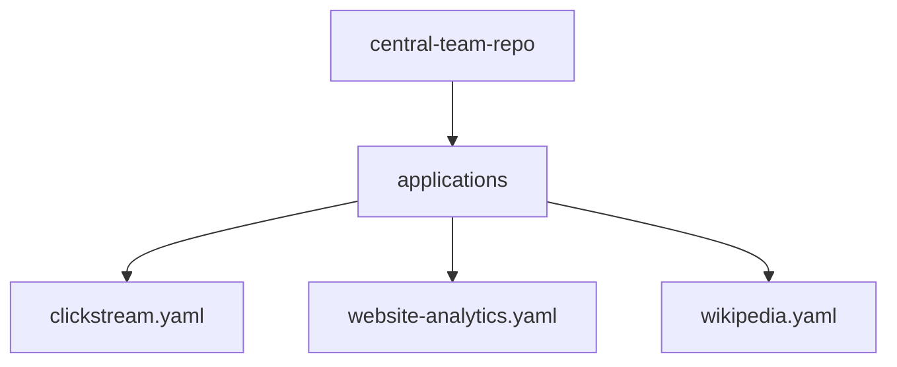
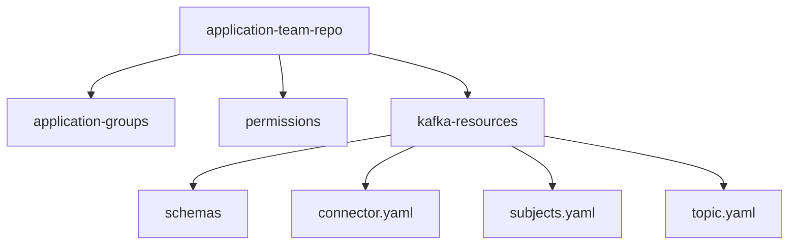

<Check>This feature is available with [Conduktor Scale Plus](https://conduktor.io/scale) only.</Check> 

This guide gives an overview of Conduktor's Self-service offering through a worked example where you will:

- Define Applications for your teams
- Set up policies to enforce governance over topic usage
- Expose topics in the topic catalog
- Experience trying to create resources that breach policies

For the full definition of each resource, see [Self-service resource reference](/guide/reference/self-service-reference).

Prefer to watch instead of reading? Check out the full demo in video (24 min):

<iframe
width="560" height="315"
src="https://www.youtube.com/embed/2LMsUolPguc?si=APLJqdJnF_hA_WD7"
title="YouTube video player"
frameborder="0" allow="accelerometer; autoplay; clipboard-write; encrypted-media; gyroscope; picture-in-picture; web-share" referrerpolicy="strict-origin-when-cross-origin" allowfullscreen>
</iframe>

To follow-along this demo you'll need to clone our repository (repo):

```shell
git clone https://github.com/conduktor/self-service-getting-started
```

This demo repo contains two directories with each representing a mock repo: `central-team-repo` and `application-team-repo`.

## Central team's repo

This repo is where the central team would make, or approve, changes.

It should contain definitions of infrastructure e.g. the cluster configuration and definitions of the Applications, Application Instances and Application Instance policies.

## Application team's repo

This repo would exist and be owned by an application team. As the application team is the owner, they make or approve changes, without requiring the central team's involvement.  

This model works because the central team has delegated appropriate scope by creating the Application and Application Instance(s) in advance. This delegation is key to Conduktor's Self-service.  

Application teams can then create, modify and approve changes on their own resources without having to request further action from the central team.

The application team's repo will have sections for the different types of resource, Kafka resources, Application Instance Permissions and Application Groups.

## Worked example

The Central team repo has created a cluster configuration in `/clusters`. Here the cluster state is assumed to be maintained by a combination of some infrastructure as code (IaC) and container management provider e.g. a Terraform and Kubernetes type setup. No need to change this file as you'll see below a full example is provided for you to test. They may have groups defined in code here too.

The central team has defined three teams,  **clickstream**, **wikipedia** and **website-analytics** each with their own **Application**, as can be seen by their respective yaml files in `/applications`.



Each of these files contains the definition of both their Application and Application Instances. The central team also have folders for their topic policies and user groups.

This example will focus on the website-analytics team.

The website analytics team has their own "repo" for their resource, which for this example will be the `application-team-repo` directory. Within they have defined their *Kafka resources* (topics, schema registry subjects, connectors), *application group(s)* for permissions within their team and an *application instance permission* for granting a different team access to their resource.



## Running the example

### Set up the demo

<Info>
Docker is required to run this demo.
</Info>

1. Spin up local resources: Conduktor and Kafka. A Docker compose file is provided - simply start it by navigating with your shell to the cloned repo and running the command below (you may need to download the images, if you've not run them before):

    ```bash
    docker compose up -d
    ```

1. Log into Console at [http://localhost:8080](http://localhost:8080), with the credentials provided in the docker-compose, `admin@conduktor.io` : `adminP4ss!`

1. Generate an admin API key for the Conduktor CLI. Go to **Settings** > **API Keys** > **New API Key** then **copy this value**.
   - Note: This can be done from the CLI by setting the following variables and running the command below, but for this demo we'll be using the UI.

     ```bash
     # not part of today's demo, shown as an example
     export CDK_USER=admin@conduktor.io 
     export CDK_PASSWORD=adminP4ss!
     conduktor login
     eyJ0eXAiOiJKV1QiLCJhbGciOiJSUzUxMiIsImtp...
     ```

1. Open the `docker-compose.yml` file and assign the value you just copied to the `CDK_API_KEY` environment variable for the `conduktor-ctl` service. Save the file and re-run `docker compose up -d` to create the Conduktor CLI container:

    ```bash
    docker compose up -d
    ```

1. Open a Conduktor CLI by executing into the container:

    ```bash
    docker compose exec -it conduktor-ctl /bin/sh
    ```

*Conduktor CLI is run as a container for convenience, you can also install it to your local machine.*

### Apply the central team's resources

With setup complete we're now ready to create the Conduktor Applications, so we can delegate responsibility to our application teams. This is from the perspective of the central team.

1. Create a Group, `website-analytics-team`. We are going to assign ownership of our Application to this group, so the group must exist before creating this Application creation.

```bash
conduktor apply -f ./self-service/central-team-repo/groups
```

1. Create policies that some application instances might leverage using the Conduktor CLI

```bash
conduktor apply -f ./self-service/central-team-repo/topic-policies/
```

The policies we've created are visible within the UI, under Topic Policies:


1. Create the team resources, the Application and the Application Instances

```bash
conduktor apply -f ./self-service/central-team-repo/applications/website-analytics.yaml #website analytics
```

Applications and their instances are visible in the **Applications Catalog**:


We now have everything ready to delegate to the application team.

### Apply the application team's resources

With our protective policies in place and the website analytics team's Application created, let's add some topics.

1. Create topics on our cluster:

```bash
conduktor apply -f ./self-service/application-team-repo/kafka-resources/topics.yaml
```

As these topics are associated to the Application Instances, we are able to visualize this link in the Topic Catalog, this helps teams discover who (which team) owns a topic to initiate a conversation, or even request access to it directly as part of a pull request.

*This may take up to 30 seconds for the new topics to appear, depending when the indexer last polled for topics.*


### Attempt to create topics out of bounds

We've demoed successful topic creation, but now let's attempt to make a topic that doesn't fit the criteria set by the central team.

The API key we've been using has been an **Admin API key**, and we needed it to create topics beyond the scope of a single Application Instance.

Remember, we've created two application instances in this demo: prod and dev, so we wouldn't want to use an application level token. 

However, to properly recreate the application team experience, for this failure, we need to use a key that is scoped to the Application Instance level.

Let's swap in the correct key now and assume the role of the website analytics prod application:

1. In Console, go to the **Application Catalog**, our application Website Analytics, the **prod** instance of the application and click `New API Key`. Click **Copy this value**.

You could also run this from the CLI:

```bash 
conduktor token create application-instance -i=website-analytics-prod my-new-key-name
eyJ0eXAiOiJKV1QiLCJhbGciOiJSUzUxMiIsImtp...
```


1. Leave the CLI container:

```bash
# You are in the CLI container
/ $ exit
```

1. Open the `docker-compose.yml` again to swap in the **new value for `CDK_API_KEY`** and restart docker compose again

```bash
docker compose up -d
```

1. When the container is restarted, step back in the CLI container

```bash
docker compose exec -it conduktor-ctl /bin/sh
```

With the CLI running using the **application instance API key**, we can properly do the test. Now back to the example.

Earlier, the central team set up the `generic-prod-topic-policy` ([check out the file](https://github.com/conduktor/self-service-getting-started/blob/main/central-team-repo/topic-policies/generic-prod-topic-policy.yaml), which specifies the following rules:  

- a `data-criticality` label must be provided with one of the specified values
- the number of partitions must be in a certain range
- the replication factor must be in a certain range
- the retention must be in a certain range

```yaml
policies:
    metadata.labels.data-criticality:
      constraint: OneOf
      values: ["C0", "C1", "C2"]
    spec.replicationFactor:
      constraint: Range
      min: 1
      max: 10
    spec.partitions:
      constraint: Range
      min: 1
      max: 10
    spec.configs.retention.ms: 
      constraint: Range
      min: 604800000 # 7 days
      max: 2419000000 # 28 days
```

When the central team created the production [application instance](https://github.com/conduktor/self-service-getting-started/blob/main/central-team-repo/applications/website-analytics.yaml), they tied this policy to it, so when this application instance tries to make topics, it must follow these rules(policies).

Here's a reminder:

```yaml
kind: "ApplicationInstance"
metadata:
  name: "website-analytics-prod"
  application: "website-analytics"
spec:
  cluster: "prod-cluster"
  serviceAccount: "sa-website-analytics"
  topicPolicyRef:
    - "generic-prod-topic-policy" # <-- Policy set against this app instance
```

So, let's try create a topic as the prod application instance that doesn't flow this policy and see what happens.

Open the team's topic file (*/application-team-repo/kafka-resources/topics.yaml*) and **append the forbidden topic config provided below** which includes an incorrect label, no replication, too many partitions and is missing retention policy. This adds the new topic to our list of topics.

Be sure to include the `---` as part of appending this block, to indicate a new resource block.

```yaml
---
apiVersion: kafka/v2
kind: "Topic"
metadata:
  name: "website-analytics.add-to-cart-fail"
  cluster: "prod-cluster"
  labels:
    data-criticality: C5
    replication: none
    domain: website-analytics
    source-repo-url: https://github.com/my-company/website-analytics
spec:
  replicationFactor: 1
  partitions: 11
  configs:
    cleanup.policy: delete
```

Save the file and re-run the topic creation:

```bash
conduktor apply -f ./self-service/application-team-repo/kafka-resources/topics.yaml
```

You'll notice you get some errors followed by some successes, this is because the `topics.yaml` used in this example contains topics for both the prod and the dev cluster; this application instance's key can't create topics on the dev cluster, as expected. We didn't get this earlier as we were using the admin API key.

The last message is the one of interest, an appropriate error from the policy we just reviewed:

```md
Could not apply resource Topic/website-analytics.add-to-cart-fail: The Topic doesn't match the expected constraints:
- At `metadata.labels.data-criticality` got "C5" expecting OneOf("C0", "C1", "C2")
- At `spec.configs.retention.ms` got null expecting Range(604800000, 2419000000)
- At `spec.partitions` got "11" expecting Range(1 to 10)
```

## Conclusion

You can copy the example repos and start mapping your own team structure. This demo doesn't cover everything, so do explore how to [grant permissions to other teams](/guide/reference/self-service-reference#applicationinstancepermission) on your owned resources or how to [set up teams within your application](/guide/reference/self-service-reference#applicationgroup).

To close down the resources, exit the CLI container with `Ctrl + D` and run `docker compose down -v`.

To discuss your requirements or find out more about Self-service, [book a demo](https://www.conduktor.io/contact/demo/?utm_source=github&utm_medium=webpage).
